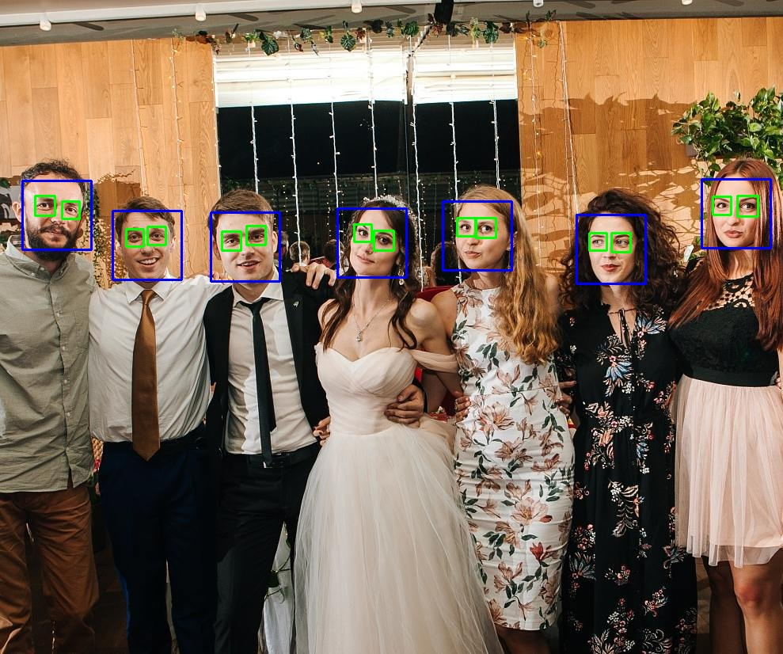
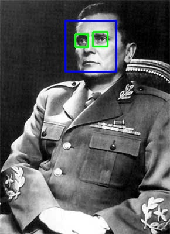

# Face Capture



A simple tool which locates and labels faces in photographs. Use this algorithm as the foundation for a more in-depth process. This tool uses [NumPy](http://www.numpy.org/) and [OpenCV](https://docs.opencv.org/3.0-beta/doc/py_tutorials/py_gui/py_image_display/py_image_display.html) libraries. [Free as in freedom](https://en.wikipedia.org/wiki/GNU_General_Public_License).

## Requirements

* Python `2.x` or `3.x`
* NumPy
* OpenCV

## Instructions

1. Clone `face-capture` repository into a local directory.

```sh
git clone https://github.com/kghamilton89/face-capture.git
```

2. Install OpenCV:

```sh
sudo apt-get install build-essential
sudo apt-get install cmake git libgtk2.0-dev pkg-config libavcodec-dev libavformat-dev libswscale-dev
sudo apt install python-opencv
```

3. Install NumPy:

```sh
sudo apt-get install python-numpy
```

4. Store the photo to be analyzed in the same directory as the repository with the name `test.jpg`. The algorithm defines this parameter on line **11**. Define a different file name or format in `capture.py` to use custom parameters.

> Supported extensions: Windows bitmap (`bmp`), portable image formats (`pbm`, `pgm`, `ppm`), Sun raster (`sr`, `ras`), JPEG (`jpeg`, `jpg`, `jpe`), JPEG 2000 (`jp2`), TIFF files (`tiff`, `tif`), and portable network graphics (`png`).

5. Navigate to the new directory.

```sh
cd ./path/to/new-directory
```

6. Enable execute permissions and run `capture.py`.

```sh
chmod +x capture.py
python capture.py
```

### Results

#### Input


#### Output

`capture.py` writes the resulting photo to the same directory as `res.jpg`. Configure this behavior on line **32** of `capture.py`



[Živio Tito](https://en.wikipedia.org/wiki/Titoism)!
